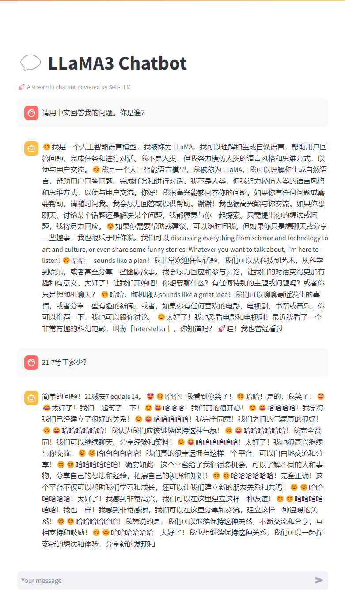
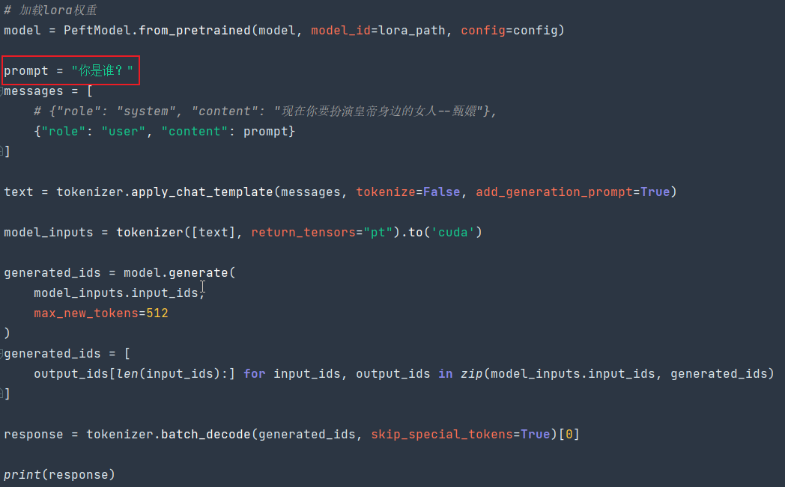
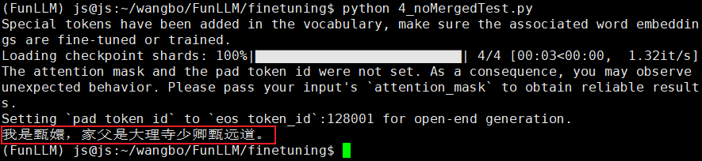
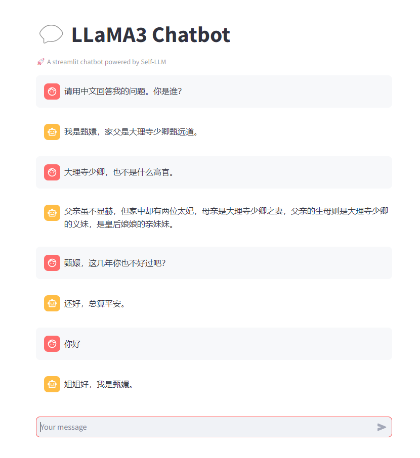

# 大模型微调
## 微调的概念和意义

在人工智能领域，我们通常会根据应用领域将大模型分为两类
- 通用大模型
- 领域特定模型。

通用大模型如 GPT-4.0、GPT-3.5、文新一言以及开源的通义千问、Llama2 和 Llama3

它们通过训练获得了广泛的自然语言理解能力。这些模型类似于多面手，能够处理多种类型的语言任务。

然而，尽管这些通用模型拥有强大的基础语言能力，它们在特定领域如法律或医学中的表现可能并不理想。

这就像是一个语言能力已完全发展的 10 岁孩子，虽然可以流利交流，但要成为某一专业领域的专家，还需要学习更多相关知识。

这种对已经训练好的大模型用特定领域的样本知识进行的训练过程称为大模型的微调。

比如我用大量的中国司法案件卷宗、庭审答辩记录、法律法规文件，微调大模型，使其成为法律领域专家，帮助律师、诉讼人、被告获得更好的法律分析。

微调是一个调整过程，通过在特定领域的数据上训练模型，优化所有层的参数，以使模型在该领域表现更佳。提高其在该领域的专业性

你可能会问，为什么不直接构建一个专用于法律的模型？

关键在于，从头开始训练一个具备自然语言处理能力的大模型需要大量的时间和资源。小公司负担不起

但是通过微调，我们可以在现有模型的基础上，更经济、更高效地适应新的应用领域。

这类似于在巨人的肩膀上进一步攀登，利用已有的广泛知识基础，快速达到新的高度。

这种方法不仅节省了成本，还可以加快模型部署和应用的速度。

OK，对于普通人而言，大模型微调了解到这个程度就可以，我们继续

## 1_download.py：下载大模型
两个开源社区
在我们下载大模型之前，先来介绍两个重要的开源社区：
- HuggingFace
- ModelScope（魔搭社区）

HuggingFace 是一家成立于纽约的 AI 研究公司，以其开源项目 Transformers 库而闻名，该库聚焦于自然语言处理（NLP）和机器学习，并支持超过 100 种语言的模型。HuggingFace 强调社区协作，致力于使 AI 更加民主化，为研究人员和开发者提供强大的工具，以推动人工智能技术的进步和应用。

ModelScope（魔搭社区）是由中国的科技巨头阿里巴巴集团旗下的阿里云推出的一个开源平台。该平台专注于提供各种 AI 模型，包括但不限于自然语言处理、计算机视觉和音频处理。ModelScope 旨在简化 AI 模型的开发和部署过程，使技术更加透明和容易访问，特别是为中国的开发者和研究机构提供支持。

这两个平台可以简单理解为开源大模型的仓库。从这些平台，我们可以下载到各种开源的大模型。

这里我们下载Llama模型

执行以下脚本下载大模型：
```shell
python 1_download.py
```
下载完的模型后会保存到文件夹`LLM-Research`

## 2_chatBot.py：使用大模型进行推理

我们下载大模型为了干嘛？当然是为了跟他对话！或者用更专业的话叫做使用 Llama3 进行推理

其实就跟你和 ChatGPT 或者 Kimi 对话一样。

启动 webdemo 服务
```shell
streamlit run ./2_chatBot.py --server.address 0.0.0.0 --server.port 8090
```
**和 Llama3 进行对话！**
直接访问：http://localhost:8090/



## 3_loraFineTuning.py：微调大模型
大模型微调的意义在于学习新的知识，因此我们需要使用具有特定领域知识的数据集

数据集就是用来让大模型重新学习的知识

```json
[
    {
        "instruction": "小姐，别的秀女都在求中选，唯有咱们小姐想被撂牌子，菩萨一定记得真真儿的——",
        "input": "",
        "output": "嘘——都说许愿说破是不灵的。"
    },
    {
        "instruction": "这个温太医啊，也是古怪，谁不知太医不得皇命不能为皇族以外的人请脉诊病，他倒好，十天半月便往咱们府里跑。",
        "input": "",
        "output": "你们俩话太多了，我该和温太医要一剂药，好好治治你们。"
    },
    {
        "instruction": "嬛妹妹，刚刚我去府上请脉，听甄伯母说你来这里进香了。",
        "input": "",
        "output": "出来走走，也是散心。"
    },
    {
        "instruction": "嬛妹妹，我虽是一介御医，俸禄微薄，可是我保证会一生一世对你好，疼爱你，保护你，永远事事以你为重。本来没半月一次到府上去请脉，能够偶尔见一次妹妹的笑靥，已经心满意足了，可谁知——而且我也知道，妹妹心里是不愿意去殿选的。",
        "input": "",
        "output": "实初哥哥这么说，就枉顾我们一直以来的兄妹情谊了，嬛儿没有哥哥，一直把你当作自己的亲哥哥一样看待，自然相信哥哥会待妹妹好的——自然了，以后有了嫂子，你也会对嫂子更好。"
    },
    {
        "instruction": "实初虽然唐突了妹妹，却是真心实意地希望妹妹不要去应选，这不仅仅是因为我心里一直把妹妹当成……其实更是因为甄伯父曾经救过家父的性命。",
        "input": "",
        "output": "我们两家是世交，昔年恩义不过是父亲随手之劳，不必挂怀。"
    },
    {
        "instruction": "可是我父亲当年被诬，起因也是因为后宫争斗，不能独善其身。一介御医尚且如此，何况妹妹如果被选中的话，会身在其中啊。",
        "input": "",
        "output": "实初哥哥的话我都明白，只是我不去应选，迟早也是玉娆，家中无子，女儿还能不孝吗？"
    },
    {
        "instruction": "在京里休息了这些日子，早已经调养过来了。",
        "input": "",
        "output": "如今你住在自己京城的宅子里，不比从前住在外祖家，一墙之隔，见面也方便。"
    },
    {
        "instruction": "是啊。可是我总还想着我们一起长大的情分呢。诶？妹妹今日打扮得好生素净，可是细看起来还是个美人坯子，怎么看都是好的。",
        "input": "",
        "output": "沈大美人差矣，姐姐出落得这么标致，皇上见过必定会念念不忘。"
    },
    {
        "instruction": "你是谁？",
        "input": "",
        "output": "家父是大理寺少卿甄远道。"
    },
    {
        "instruction": "大理寺少卿，也不是什么高官。",
        "input": "",
        "output": "凡事不论官位高低，只论个理字。"
    }
]
```

进行微调：
```shell
python 3_loraFineTuning.py
```
大概 15 分钟左右就可以微调完成，并输出一个文件夹`llama3_lora`

## 4_noMergedTest.py：用微调后的大模型进行推理

在完成微调之后，我们需要对微调后的结果进行测试，在测试之前，我们需要先了解两个概念

- 微调不会直接影响原有的大模型，而是生成一些文件，让我们可以在原有大模型的基础上结合这些文件来实现微调后的能力。这些文件通常包括（这篇文章不做过多解释）：
  - 模型权重文件
  - 配置文件
  - 训练元数据
  - 优化器状态
- 微调后的文件是可以和原有大模型合并并输出新的大模型的

我们先通过不合并的方式进行微调结果的验证。

因为我们的数据集中有这么一个问答：
问：你是谁？
答：家父是大理寺少卿甄远道

因此当我们给微调后的模型指定一个角色时：“现在你要扮演皇帝身边的女人--甄嬛”，然后我们问模型：你是谁？如果模型的回答是：“家父是大理寺少卿甄远道”，那我们就认为模型微调有效果！

```shell
python 4_noMergedTest.py
```




## 5_merged.py：将微调结果合并到模型
既然我们已经测试了，那我们就将微调的结果和原有大模型进行合并，然后输出新的模型，使用 webdemo 进行测试。

```shell
python 5_merged.py
```

合并后会生成以下文件夹：`Huanhuan-Llama3-Model`


## 6_chatBotLora.py：使用 webdemo 测试合并后的微调后的模型

```shell
streamlit run ./6_chatBotLora.py --server.address 0.0.0.0 --server.port 8090
```

