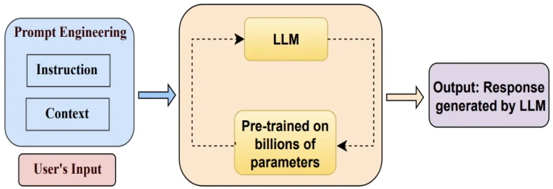

对于一个使用了海量数据训练的大语言模型，我们只需要提供一些提示词，就可以让模型生成想要的内容。


prompt万能公式：

* 角色+角色技能+任务核心关键词+任务目标+任务背景+任务范围+任务解决与否判定+任务限制条件+输出格式/形式+输出量

吴恩达：

* 原则一：写出清晰而具体的指示
* 原则二：给模型思考的时间

OpenAI六大策略：

1. 写清晰的指示
2. 给模型提供参考（也就是示例）
3. 将复杂任务拆分成子任务（思维链、思维树）
4. 给 GPT 时间思考
5. 使用外部工具
6. 反复迭代问题

## 案例

### 一：在提示词中给出示例

输入：
```
鲜花类型: 玫瑰
场合: 爱情
文案: 玫瑰，浪漫的象征，是你向心爱的人表达爱意的最佳选择。

鲜花类型: 康乃馨
场合: 母亲节
文案: 康乃馨代表着母爱的纯洁与伟大，是母亲节赠送给母亲的完美礼物。

鲜花类型: 百合
场合: 庆祝
文案: 百合象征着纯洁与高雅，是你庆祝特殊时刻的理想选择。

鲜花类型: 向日葵
场合: 鼓励
文案: 向日葵象征着坚韧和乐观，是你鼓励亲朋好友的最好方式。

鲜花类型: 野玫瑰
场合: 爱情
```

输出：
```
鲜花类型: 野玫瑰
场合: 爱情
文案: 野玫瑰，自然纯粹的美，是你向心爱的人表达独特爱情的完美方式。
```

### 二：思维链（Chain of Thought）

如果生成一系列的中间推理步骤，就能够显著提高大型语言模型进行复杂推理的能力。

没有思维链：
```
罗马帝国为什么会衰落？
```

有思维链：
```
请逐步分析为什么罗马帝国会衰落。首先，列出主要的内部和外部因素，然后详细解释每个因素的影响，最后总结这些因素如何共同导致了罗马帝国的衰落。
```

```
一个杂技人员可以抛16个球，其中有一半是高尔夫球，高尔夫球中有一半是蓝色的，那么有多少个蓝色高尔夫球？请一步步地分析问题。
```


### 三：角色设定

有助于避免模型胡言乱语
```
你是一个很有经验的 XX 专家，...
```


## 最佳实践

### 一：[公文笔杆子](https://github.com/jason-wang1/FunLLM/blob/main/prompts/%E5%85%AC%E6%96%87%E7%AC%94%E6%9D%86%E5%AD%90.md)

### 二：[岗位职责生成器](https://github.com/jason-wang1/FunLLM/blob/main/prompts/%E5%B2%97%E4%BD%8D%E8%81%8C%E8%B4%A3%E7%94%9F%E6%88%90%E5%99%A8.md)

### 三：[爆款文案生成器](https://github.com/jason-wang1/FunLLM/blob/main/prompts/%E7%88%86%E6%AC%BE%E6%96%87%E6%A1%88%E7%94%9F%E6%88%90%E5%99%A8.md)
