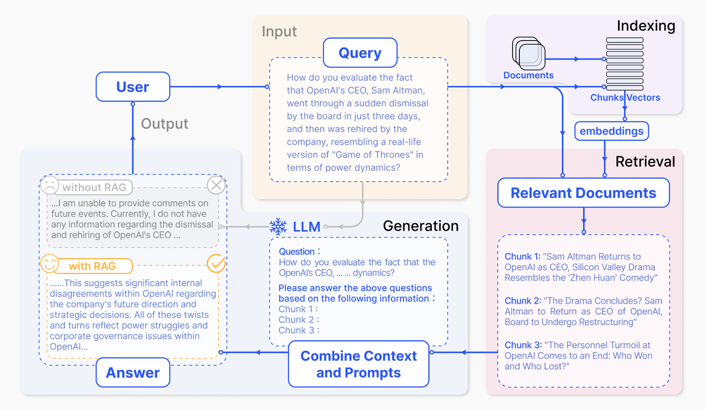

# 大语言模型应用核心技术

## 检索增强生成（Retrieval-Augmented Generation，RAG）
如果提问超出了大语言模型的知识范围，模型要么坦白：“我的训练时间截至 XXXX 年 XX 月 XX 日”，要么它就会开始一本正经地胡说。

LLM会产生误导性的 “幻觉”，依赖的信息可能过时，处理特定知识时效率不高，缺乏专业领域的深度洞察，同时在推理能力上也有所欠缺。

正是在这样的背景下，检索增强生成技术（Retrieval-Augmented Generation，RAG）应时而生，成为 AI 时代的一大趋势。

RAG 通过在语言模型生成答案之前，先从广泛的文档数据库中检索相关信息，然后利用这些信息来引导生成过程，极大地提升了内容的准确性和相关性。RAG 有效地缓解了幻觉问题，提高了知识更新的速度，并增强了内容生成的可追溯性，使得大型语言模型在实际应用中变得更加实用和可信。

RAG的基本结构有哪些呢？

* 向量化模块：用来将文档片段向量化。
* 文档加载和切分的模块：用来加载文档并切分成文档片段。
* 数据库：存放文档片段和对应的向量表示
* 检索模块：用来根据 Query （问题）检索相关的文档片段。
* 大模型模块：用来根据检索出来的文档回答用户的问题。

案例：用户所提出的问题，包含了模型训练时并不知道的消息
1. 用户：您如何评价OpenAI首席执行官Sam Altman在短短三天内突然被董事会解雇，随后又被公司重新聘用，权力变更就像现实版“权力的游戏”。
2. 检索文档
   1. chuck1："Sam Altman回归OpenAI任CEO，硅谷大戏堪比'甄嬛传'"
   2. chuck2："大戏落幕？Sam Altman将重回OpenAI出任CEO，董事会将进行重组"
   3. chuck3："OpenAI个人风波落幕：谁赢谁输？"
3. 将检索到的相关文档信息与用户的问题合并起来输入模型
4. 大模型生成回答：这表明 OpenAI 内部对公司未来发展存在重大分歧，这些曲折都反映了 OpenAI 内部的权力斗争和公司治理问题

如果没有检索文档，大模型生成回答：我没有找到OpenAI首席执行官被解雇并重新聘用的信息。

RAG vs fine-tuning：
* fine-tuning 目的是让大模型在特定领域有很好的表现。适用于高度专业化的应用场景
* RAG 目的是减少大模型幻觉，并对知晓最近发生的事件。需要广泛知识覆盖且实时信息更新的应用场景

## 大语言模型赋能的智能体（Agent）
* 工具能力：我们不仅可以用本地知识库（RAG）赋能大语言模型，还可以进一步地调用外部工具检索（谷歌搜索）
* 感知能力：我对一个机器人管家说：”请打扫客厅“，机器人需要利用传感器判断客厅的范围在哪里
* 行动能力：机器人管家说：”好的，我开始打扫客厅“，并做出了打扫客厅的动作

因此，大语言模型赋能的Agent，不仅具有语言理解和生成的能力，还可以调用外部工具，感知周围的环境，并具备一些行动能力。

不过Agent很早就出现了，但是传统的Agent泛化性比较差，只能适用于某一类问题，比如围棋领域的AlphaGo

基于大语言模型，可以创建更广泛适用的Agent

Agent发展历程：

